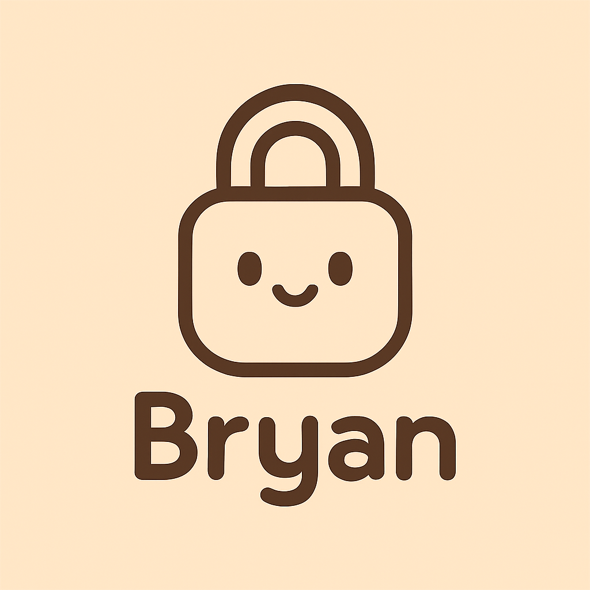

<a name="readme-top"></a>

<br/>

<br />
<div align="center">
  <a href="https://github.com/watoshiiie0106">
    
  </a>

  <h3 align="center">My Portfolio</h3>
</div>

<div align="center">
  A comprehensive portfolio website showcasing web development skills, projects, and professional experience.
  
  <h3 align="center">Watoshiiie</h3>
</div>
<br />


[](https://wakatime.com/badge/user/018dd99a-4985-4f98-8216-6ca6fe2ce0f8/project/63501637-9a31-42f0-960d-4d0ab47977f8)

[My WakaTime Project](https://wakatime.com/@8a4344d8-d020-4065-83a2-c103e04a6752/projects/cimzrmabqc?start=2025-06-26&end=2025-07-02)
---

<br />
<br />

<!-- TODO: If you want to add more layers for your readme -->
<details>
  <summary>Table of Contents</summary>
  <ol>
    <li>
      <a href="#overview">Overview</a>
      <ol>
        <li>
          <a href="#key-components">Key Components</a>
        </li>
        <li>
          <a href="#technology">Technology</a>
        </li>
      </ol>
    </li>
    <li>
      <a href="#rules-practices-and-principles">Rules, Practices and Principles</a>
    </li>
    <li>
      <a href="#resources">Resources</a>
    </li>
  </ol>
</details>

---

## Overview

This is a responsive, modern portfolio built to present my skills, academic background, and projects as a student pursuing BS in Information Technology major in Cybersecurity at FEU Institute of Technology.

- **Home Page** – Welcome message and photo
- **About Me** – Info about myself and my background
- **Education** – My school and achievements
- **Projects** – Some of my work and activities
- **Contact** – Ways to reach me
- **Quick Links** – Easy access to each section


### Technology


WD-Finals
├── assets
│ ├── css
│ │ └── style.css
│ ├── img
│ │ └── main_page_pic.jpg
│ └── js
│ └── script.js
├── pages
│ ├── About me
│ │ └── index.html
│ ├── Education
│ │ └── index.html
│ ├── Projects
│ │ └── index.html
│ └── Contact_information
│ └── index.html
├── index.html
└── README.md
```

## Resources

| Title     | Purpose            | Link                       |
|----------|--------------------|----------------------------|
| Portfolio | Portfolio Website  | *(Add your website URL)*   |
| Github    | My Github account  | [GitHub](https://github.com/) |